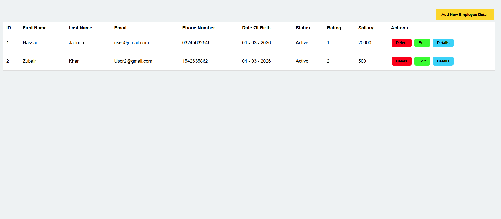
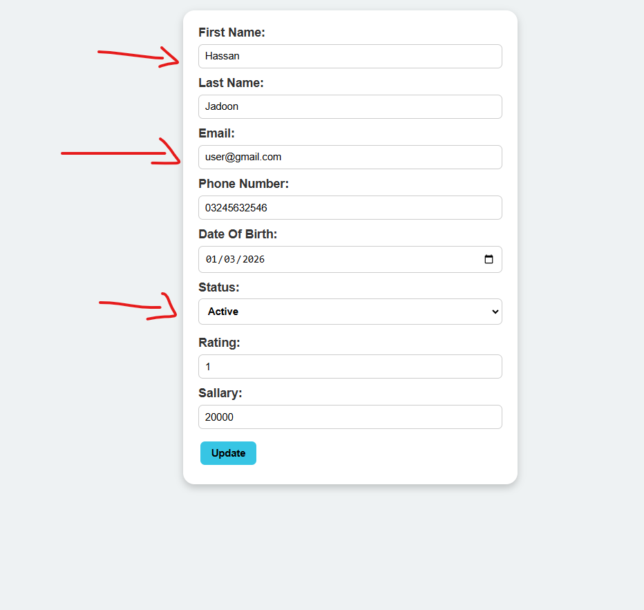
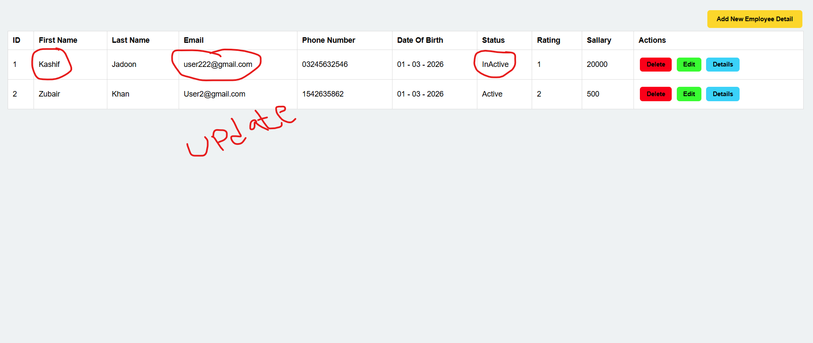
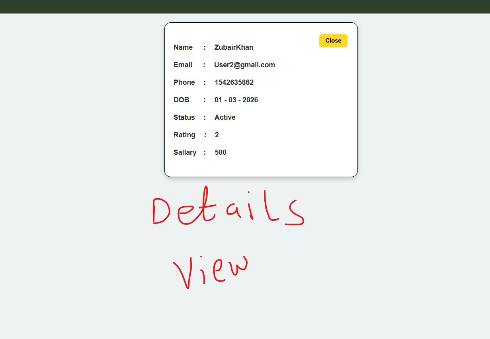
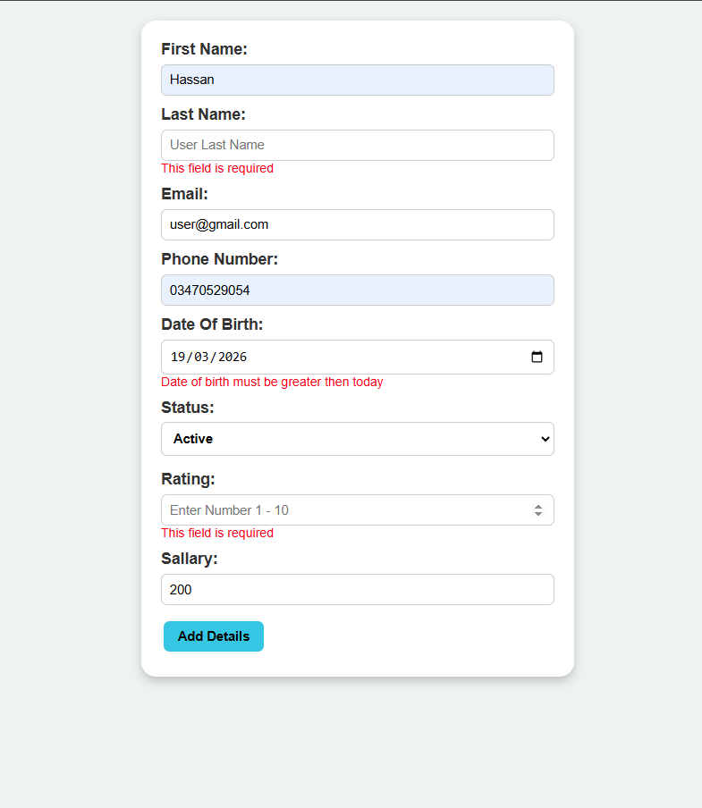
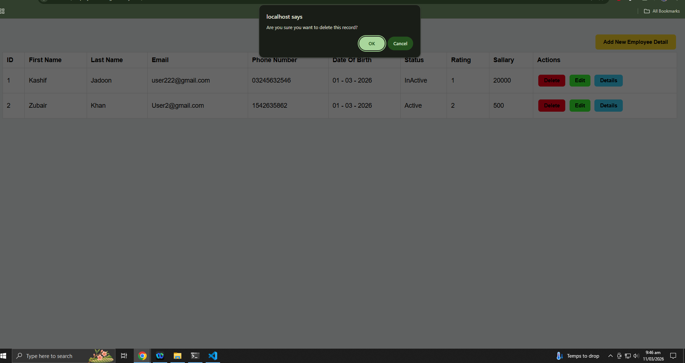
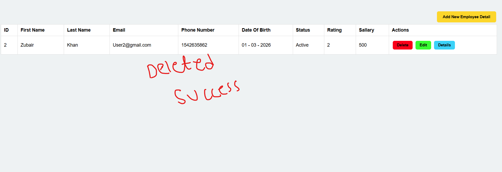

# Employee Management System


A simple **Employee Management System** built with **PHP (MySQLi), MySQL, jQuery, AJAX, HTML, and CSS**.
This project allows users to **Add, Update, View, and Soft Delete employee records** with form validation and duplicate email checking.

---

# 🚀 Features

✔ Add new employee records
✔ Edit employee information
✔ Soft delete employee records
✔ AJAX based insert & update
✔ Duplicate email validation
✔ Form validation using jQuery
✔ Employee details popup view
✔ Clean employee table interface

---

# 🛠 Technologies Used

| Technology   | Purpose                      |
| ------------ | ---------------------------- |
| PHP (MySQLi) | Backend logic                |
| MySQL        | Database                     |
| HTML5        | Structure                    |
| CSS3         | Styling                      |
| jQuery       | DOM manipulation             |
| AJAX         | Asynchronous form submission |

---

# 📂 Project Structure

```
employee-management-system
│
├── screenshots
│   ├── employee-table.png
│   ├── add-employee-form.png
│   ├── edit-employee-form.png
│   ├── updated-employee-form.png
│   ├── employee-details-popup.png
│   ├── validation-error.png
│   ├── delete-employee.png
│   └── deleted-employee.png
│
├── index.php
├── check_email.php
├── stylesheet.css
├── jquerylibrary.js
└── README.md
```

---

# 🗄 Database Schema

Database name:

```
Employees
```

Table:

```
employee
```

| Column        | Type              | Description       |
| ------------- | ----------------- | ----------------- |
| id            | INT (Primary Key) | Employee ID       |
| first_name    | VARCHAR(100)      | First Name        |
| last_name     | VARCHAR(100)      | Last Name         |
| email         | VARCHAR(100)      | Unique Email      |
| phone_number  | VARCHAR(15)       | Phone Number      |
| date_of_birth | DATE              | Employee DOB      |
| status        | VARCHAR(50)       | Active / Inactive |
| rating        | DECIMAL           | Employee rating   |
| sallary       | DECIMAL           | Employee salary   |
| is_deleted    | TINYINT           | Soft delete flag  |

---

# ⚙️ Installation Guide

### 1️⃣ Clone Repository

```
git clone https://github.com/yourusername/employee-management-system.git
```

---

### 2️⃣ Move Project

Move the project folder into:

```
htdocs
```

(for XAMPP)

or

```
www
```

(for WAMP)

---

### 3️⃣ Start Server

Start the following services from XAMPP/WAMP control panel:

* Apache
* MySQL

---

### 4️⃣ Open in Browser

```
http://localhost/Employee-Managment-System
```

The application will automatically create:

* the **database**
* the **employee table**

---

# 📸 Screenshots

### Employee Table



### Add Employee Form


### Edit Employee



### Updated Employee



### Employee Details Popup



### Validation Error



### Before Delete



### After Delete (Soft Delete)



---

# 🔐 Validation Features

The project includes multiple validations:

* Required fields validation
* Email format validation
* Duplicate email check using AJAX
* Date of birth validation
* Rating input validation
* Salary validation

---

# ⚡ AJAX Functionality

AJAX is used for:

* Checking duplicate email
* Inserting employee data
* Updating employee records

This improves **user experience** by avoiding full page reloads.

---

# 🔄 Soft Delete System

Employees are **not permanently deleted**.

Instead the system updates:

```
is_deleted = 1
```

This allows data recovery and keeps database history safe.

---

# 🧠 Learning Purpose

This project is useful for learning:

* PHP CRUD operations
* MySQL database structure
* AJAX integration with PHP
* jQuery form validation
* Dynamic UI interactions

---

# 🔮 Future Improvements

* 🔎 Search employees

* 📄 Pagination system

* 📊 Dashboard statistics

* 🔐 PDO prepared statements for better security

* 📱 Responsive UI design

* 📁 MVC project architecture

* 🌐 REST API integration

---

# 👨‍💻 Author

**Hassan Zohaib Jadoon**

GitHub:
https://github.com/HassanZohaibJadooni/

---

⭐ If you like this project, please **star the repository**.
