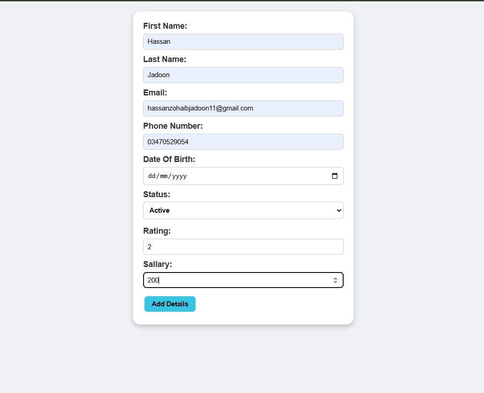

# Employee Management System


A simple **Employee Management System** built with **PHP (MySQLi), MySQL, jQuery, AJAX, HTML, and CSS**.
This project allows users to **Add, Update, View, and Soft Delete employee records** with form validation and duplicate email checking.

---

# 🚀 Features

✔ Add new employee records
✔ Edit employee information
✔ Soft delete employee records
✔ AJAX based insert & update
✔ Duplicate email validation
✔ Form validation using jQuery
✔ Employee details popup view
✔ Clean table view of employees

---

# 🛠 Technologies Used

| Technology   | Purpose               |
| ------------ | --------------------- |
| PHP (MySQLi) | Backend logic         |
| MySQL        | Database              |
| HTML5        | Structure             |
| CSS3         | Styling               |
| jQuery       | DOM manipulation      |
| AJAX         | Async form submission |

---

# 📂 Project Structure

```
employee-management-system
│
├── screenshots├──employee-table.png

                ├──add-employee-form.png
                ├──edit-employee-form.png
                ├──updated-employee-form.png
                ├──employee-details-popup.png
                ├──validation-error.png
                ├──delete-employee.png
                ├──deleted-employee.png
                
├── index.php
├── check_email.php
├── stylesheet.css
├── jquerylibrary.js
└── README.md
```

---

# 🗄 Database Schema

Database name:

```
Employees
```

Table:

```
employee
```

| Column        | Type              | Description       |
| ------------- | ----------------- | ----------------- |
| id            | INT (Primary Key) | Employee ID       |
| first_name    | VARCHAR(100)      | First Name        |
| last_name     | VARCHAR(100)      | Last Name         |
| email         | VARCHAR(100)      | Unique Email      |
| phone_number  | VARCHAR(15)       | Phone Number      |
| date_of_birth | DATE              | Employee DOB      |
| status        | VARCHAR(50)       | Active / Inactive |
| rating        | DECIMAL           | Employee rating   |
| sallary       | DECIMAL           | Employee salary   |
| is_deleted    | TINYINT           | Soft delete flag  |

---

# ⚙️ Installation Guide

### 1️⃣ Clone Repository

```
git clone https://github.com/yourusername/employee-management-system.git
```

---

### 2️⃣ Move Project

Move project folder into

```
htdocs
```

(XAMPP)

or

```
www
```

(WAMP)

---

### 3️⃣ Start Server

Start

- Apache
- MySQL

from XAMPP / WAMP control panel.

---

### 4️⃣ Open Browser

```
http://localhost/Employee-Managment-System
```

The project will automatically create:

- database
- table

---

# 📸 Screenshots

## Screenshots

### Employee Table


### Add Employee



### Edit Employee


### Updated Employee


### Details Popup


### Validation


### Before Deleted


### Validation


## Employee Table

Shows all employees in a table view.

## Add Employee Form

Form used to insert employee details.

## Edit Employee

Edit existing employee record.

## Employee Details Popup

View complete employee details.

---

# 🔐 Validation Features

The project includes multiple validations:

- Required fields validation
- Email format validation
- Duplicate email check using AJAX
- Date of birth validation
- Rating input validation
- Salary validation

---

# ⚡ AJAX Functionality

AJAX is used for:

- Email duplicate checking
- Insert employee
- Update employee

This avoids full page reload and improves user experience.

---

# 🔄 Soft Delete System

Employees are not permanently removed.

Instead:

```
is_deleted = 1
```

This keeps database history safe.

---

# 🧠 Learning Purpose

This project is great for learning:

- PHP CRUD operations
- MySQL database design
- AJAX integration
- jQuery form validation
- Dynamic UI with JavaScript

---

# 🔮 Future Improvements

Possible upgrades:

🔎 Search employees
📄 Pagination
📊 Dashboard statistics
🔐 PDO prepared statements
📱 Responsive UI
📁 MVC project structure
🌐 REST API integration

---

# 👨‍💻 Author

**Hassan Zohaib Jadoon**

GitHub:
https://github.com/HassanZohaibJadooni/

---

⭐ If you like this project, please **star the repository**.
